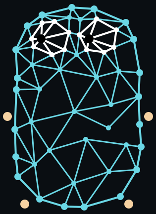

# gonnect-netstack

This module integrates
[gVisor's netstack](https://github.com/google/gvisor/tree/master/pkg/tcpip)
into the [gonnect](https://github.com/asciimoth/gonnect) ecosystem,
providing userspace networking with full TCP/IP stack capabilities.

> [!IMPORTANT]
> This project was originally based on code extracted from wireguard-go.
> Although it has been significantly modified to fit the gonnect ecosystem,
> I must mention the original source to comply with the license.
> All credit goes to the original wireguard-go authors.

## Packages

### vtun

The `vtun` package provides a virtual tunnel built on gVisor's netstack.
It acts as an **L4 → L3 converter**, accepting high-level dial/listen
operations (TCP, UDP, ICMP) and producing a stream of raw IP packets.
It implements gonnect's `Network`, `Resolver`, `InterfaceNetwork`, `UpDown`,
and `tun.Tun` interfaces, making it a drop-in userspace network stack for
gonnect applications.

- `DialTCP` / `ListenTCP` — TCP connection and listener management
- `DialUDP` / `ListenUDP` — UDP socket support
- `DialPingAddr` / `ListenPingAddr` — ICMP echo request/reply
- Built-in ismple DNS resolution with configurable servers
- Wildcard address binding and automatic local address selection

### spoofer

The `spoofer` package is the inverse of `vtun`.
It acts as an **L3 → L4 converter**, accepting incoming IP packet streams
(from a TUN device or any `io.ReadWriteCloser`) and converting them back
into individual TCP/UDP connections via gVisor's forwarders.
It's useful for intercepting, forwarding, or proxying traffic
at the packet level.

- TCP and UDP forwarders with configurable callbacks
- Extensive TCP/IP tuning options
- Works with TUN devices or arbitrary `io.ReadWriteCloser` endpoints

