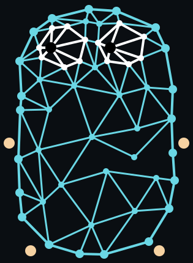

<p align="center">

</p>

[](https://pkg.go.dev/github.com/asciimoth/gonnect-netstack)  
# gonnect-netstack

This module integrates
[gVisor's netstack](https://github.com/google/gvisor/tree/master/pkg/tcpip)
into the [gonnect](https://github.com/asciimoth/gonnect) ecosystem,
providing userspace networking with full TCP/IP stack capabilities.

> [!IMPORTANT]
> __vtun__ package in project was originally based on code extracted from wireguard-go.
> Although it has been significantly modified to fit the gonnect ecosystem,
> I must mention the original source to comply with the license.
> All credit goes to the original wireguard-go authors.

## Packages

### vtun

The `vtun` package provides a virtual tunnel built on gVisor's netstack.
It acts as an **L4 → L3 converter**, accepting high-level dial/listen
operations (TCP, UDP, ICMP) and producing a stream of raw IP packets.
It implements gonnect's `Network`, `Resolver`, `InterfaceNetwork`, `UpDown`,
and `tun.Tun` interfaces, making it a drop-in userspace network stack for
gonnect applications.

- `DialTCP` / `ListenTCP` — TCP connection and listener management
- `DialUDP` / `ListenUDP` — UDP socket support
- `DialPingAddr` / `ListenPingAddr` — ICMP echo request/reply
- Built-in simple DNS resolution with configurable servers
- Wildcard address binding and automatic local address selection
- Destination-based source address routing

#### Source address routing

Use `SourceRoutes` when one VTun has multiple local addresses and the remote
destination must select the source address. The route with the longest matching
prefix has priority.

```go
opts := vtun.Opts{
	LocalAddrs: []netip.Addr{
		netip.MustParseAddr("10.20.0.2"),
		netip.MustParseAddr("100.64.0.2"),
	},
	SourceRoutes: []vtun.SourceRoute{
		{
			Destination: netip.MustParsePrefix("100.64.0.0/10"),
			Source:      netip.MustParseAddr("100.64.0.2"),
		},
		{
			Destination: netip.MustParsePrefix("0.0.0.0/0"),
			Source:      netip.MustParseAddr("10.20.0.2"),
		},
	},
}

device, err := opts.Build()
```

The source address must be in `LocalAddrs`. Add an explicit `0.0.0.0/0` or
`::/0` route if a configured family needs a fallback. If a family has source
routes without a matching route, a new operation returns a network-unreachable
error. A family without source routes keeps the legacy first-address behavior.

Call `SetSourceRoutes` to replace the table while the VTun is running. New
flows use the new table. Existing TCP, connected UDP, and connected ICMP flows
keep the source address that they selected when they connected.

### spoofer

The `spoofer` package is the inverse of `vtun`.
It acts as an **L3 → L4 converter**, accepting incoming IP packet streams
(from a TUN device or any `io.ReadWriteCloser`) and converting them back
into individual TCP/UDP connections via gVisor's forwarders.
It's useful for intercepting, forwarding, or proxying traffic
at the packet level.

- TCP and UDP forwarders with configurable callbacks
- Extensive TCP/IP tuning options
- Works with TUN devices or arbitrary `io.ReadWriteCloser` endpoints
